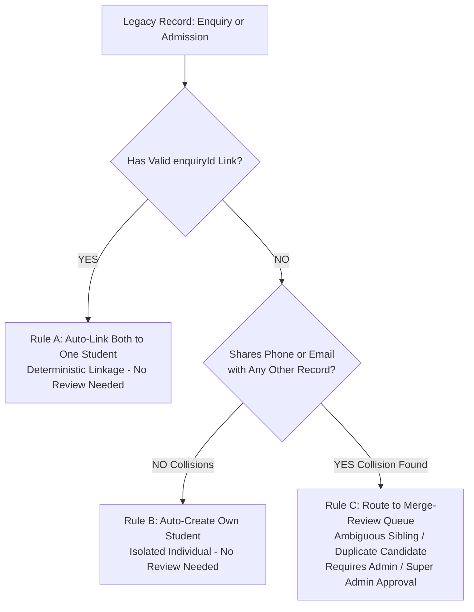
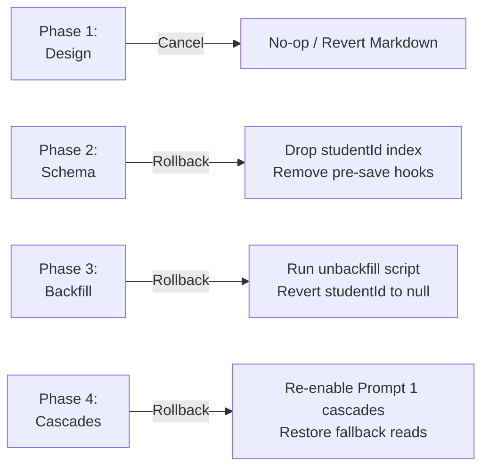

# Student Master Identity Migration Design Document (`STUDENTS_MIGRATION.md`)

> **Status:** Revised per Stakeholder Requirements — Pending Final Approval  
> **Author:** Antigravity Engineering  
> **Target Version:** Lead2Leadure Architecture v2.2  

---

## 1. Executive Summary & Objective

In the current data architecture, a student's personal identity is duplicated across two independent workflows:
- **`enquiries`** (pre-enrolment CRM leads): stores `studentFullName`, `primaryPhoneMobile`, `parentsPhoneNumber`, `emailAddress`, etc.
- **`admissions`** (enrolled students): stores `fullName`, `mobileNumber`, `parentPhone`, `email`, etc.

When a student changes their name, contact details, or parent phone numbers, multi-collection update cascades were introduced (in Prompt 1) to push changes across `Admission`, `Enquiry`, and `Task`. This creates significant architectural risks:
1. **Data Drift:** If an enquiry is updated directly, or if an admission has no linked `enquiryId`, records fall out of sync.
2. **Multiple Enrolments:** A single individual taking a second course or returning years later creates a disjointed identity.
3. **Fragile Synchronization:** Updates require complex multi-document transaction cascades that can fail or cause lock contention.

### Core Objective
Introduce a single master collection **`students`** so an individual person's identity and contact coordinates live in one authoritative record.
- **`Enquiry`** and **`Admission`** documents link to the master student via `studentId: ObjectId (ref: Student)`.
- **Duplicate Detection** uses phone matching as **SUGGESTIONS ONLY** for staff human review—**NEVER AUTOMATIC**.
- **Name and identity edits** happen exclusively on the `Student` master record; operational collections dynamically read the authoritative name via `studentId`.
- **`Payment` records retain their immutable historical `studentName`** snapshot for legal and GST receipt integrity.
- **Prompt 1 cascade code is completely retired** once all reads transition to `studentId`.

```mermaid
graph TD
    subgraph Master Identity
        S[Student Master<br/>_id, studentCode, fullName, primaryPhone, email, ...]
    end

    subgraph Operational Documents
        E1[Enquiry 1<br/>studentId: S._id<br/>Course: AutoCAD]
        E2[Enquiry 2<br/>studentId: S._id<br/>Course: Revit]
        A1[Admission 1<br/>studentId: S._id<br/>Batch: Batch A]
        T1[Task / Followup<br/>studentId: S._id]
        N1[Notification<br/>studentId: S._id]
    end

    subgraph Financial Receipts
        P1[Payment Receipt<br/>admissionId: A1._id<br/>studentId: S._id<br/>studentName: 'Snapshot Name' (Permanent)]
    end

    S -->|1-to-Many Dynamic Read| E1
    S -->|1-to-Many Dynamic Read| E2
    S -->|1-to-Many Dynamic Read| A1
    S -->|Dynamic Name Read| T1
    S -->|Dynamic Name Read| N1
    A1 -->|Generates| P1
```

---

## 2. Master Schema Specification (`students`)

The `students` collection centralizes identity attributes into a clean, normalized structure. It incorporates our global context audit plugin (`timestamps`, `createdBy`, `updatedBy`) and soft delete plugin (`isDeleted`, `deletedAt`, `deletedBy`).

### 2.1 Mongoose Schema Definition
```typescript
import mongoose, { Schema, Document } from "mongoose";
import { auditContextPlugin } from "@/lib/auditContextPlugin";
import { softDeletePlugin } from "@/lib/softDeletePlugin";

export interface IStudent extends Document {
  studentCode: string;           // E.g. "STU-2026-0001", unique business ID
  fullName: string;              // Authoritative full legal name
  primaryPhone: string;          // Normalized 10-digit mobile number
  alternatePhone?: string;       // Secondary personal contact
  email?: string;                // Lowercased personal email
  parentName?: string;           // Father / Mother / Guardian 1 name
  parentPhone?: string;          // Guardian 1 contact
  guardian2Name?: string;        // Secondary Guardian / Mother name
  guardian2Phone?: string;       // Secondary Guardian contact
  city?: string;                 // Current city of residence
  address?: string;              // Full address
  state?: string;
  pincode?: string;
  dob?: string;
  gender?: string;
  status: "ACTIVE" | "ARCHIVED"; // Account status
  createdAt: Date;
  updatedAt: Date;
  createdBy?: mongoose.Types.ObjectId;
  updatedBy?: mongoose.Types.ObjectId;
  isDeleted: boolean;
  deletedAt?: Date;
  deletedBy?: mongoose.Types.ObjectId;
}

const StudentSchema = new Schema<IStudent>(
  {
    studentCode: {
      type: String,
      required: true,
      unique: true,
      trim: true,
      index: true,
    },
    fullName: {
      type: String,
      required: true,
      trim: true,
      index: true,
    },
    primaryPhone: {
      type: String,
      required: true,
      trim: true,
      index: true,
    },
    alternatePhone: {
      type: String,
      trim: true,
      default: "",
    },
    email: {
      type: String,
      trim: true,
      lowercase: true,
      default: "",
    },
    parentName: {
      type: String,
      trim: true,
      default: "",
    },
    parentPhone: {
      type: String,
      trim: true,
      default: "",
    },
    guardian2Name: {
      type: String,
      trim: true,
      default: "",
    },
    guardian2Phone: {
      type: String,
      trim: true,
      default: "",
    },
    city: {
      type: String,
      trim: true,
      default: "",
    },
    address: {
      type: String,
      trim: true,
      default: "",
    },
    state: {
      type: String,
      trim: true,
      default: "",
    },
    pincode: {
      type: String,
      trim: true,
      default: "",
    },
    dob: {
      type: String,
      trim: true,
      default: "",
    },
    gender: {
      type: String,
      trim: true,
      default: "",
    },
    status: {
      type: String,
      enum: ["ACTIVE", "ARCHIVED"],
      default: "ACTIVE",
      index: true,
    },
  },
  { timestamps: true }
);

// Compound Indexes for fast duplicate scanning & search
StudentSchema.index({ primaryPhone: 1, isDeleted: 1 });
StudentSchema.index({ email: 1, isDeleted: 1 });
StudentSchema.index({ fullName: "text", city: "text" });

// Apply Global Context and Soft Delete Plugins
StudentSchema.plugin(auditContextPlugin);
StudentSchema.plugin(softDeletePlugin);

export default mongoose.models.Student || mongoose.model<IStudent>("Student", StudentSchema);
```

---

## 3. Linking Architecture & Ingestion Invariants

### 3.1 Schema Additions
In [`src/models/Enquiry.ts`](file:///c:/Users/singh/OneDrive/Desktop/Lead2leadure/src/models/Enquiry.ts) and [`src/models/Admission.ts`](file:///c:/Users/singh/OneDrive/Desktop/Lead2leadure/src/models/Admission.ts):
```typescript
// Added to EnquirySchema:
studentId: {
  type: Schema.Types.ObjectId,
  ref: "Student",
  index: true,
  default: null,
}

// Added to AdmissionSchema:
studentId: {
  type: Schema.Types.ObjectId,
  ref: "Student",
  index: true,
  default: null,
}
```

### 3.2 Phase 2 Ingestion Invariants (No Record Without a `studentId`)
From the moment Phase 2 ships:
1. **Every New Enquiry**:
   - Creating an enquiry (`POST /api/enquiries`, Justdial webhook, or manual staff entry) **automatically creates a `Student` master record** (or links to an existing verified `Student`), setting `enquiry.studentId = student._id`.
2. **Every New Admission**:
   - An admission created from an enquiry (`POST /api/admissions` with `enquiryId`) **must reuse that Enquiry's `studentId`** (`admission.studentId = enquiry.studentId`).
   - A direct admission created without an enquiry creates a new `Student` master record and sets `admission.studentId = student._id`.
3. **Strict Validation Rule**:
   - **No new record may be created without a `studentId`**.
   - Mongoose pre-save hooks on `Enquiry` and `Admission` enforce that `this.isNew` requires `this.studentId != null`, throwing an explicit validation error if missing.

---

## 4. Phase 3 Backfill Rules: Automated vs. Review Queue

> [!IMPORTANT]
> **Deterministic Triage Architecture:**  
> To guarantee 100% data integrity without forcing staff to manually review thousands of obvious matches, backfill uses a strict three-tier classification:
> 1. **Explicit links** are linked automatically.
> 2. **Completely isolated records** are created automatically.
> 3. **Ambiguous collisions** (and ONLY ambiguous collisions) go to the human review queue.



### 4.1 Rule A: Explicit Link Auto-Linkage (No Review Needed)
- When an `Admission` has a valid `enquiryId` referencing an existing `Enquiry`:
  - The system has already explicitly recorded that this admission originated from that specific enquiry.
  - The backfill script automatically creates **one** `Student` record (or reuses an existing one if already linked) and updates both `admission.studentId` and `enquiry.studentId` to point to it.
  - Attributes are coalesced with the `Admission` given precedence for the latest contact details.

### 4.2 Rule B: Unique Isolates Auto-Creation (No Review Needed)
- Any `Enquiry` or `Admission` that does **not** share a normalized mobile number or email address with any other record in the entire database:
  - There is zero ambiguity and zero possibility of duplicate collision.
  - The backfill automatically creates an independent `Student` record and sets `record.studentId = student._id`.

### 4.3 Rule C: Merge-Review Queue (Human Review Required)
- Only records that share a normalized phone number or email address with **no explicit link** between them (e.g. two separate enquiries with the same phone, an enquiry and an admission without an `enquiryId` link, or two separate admissions with the same phone):
  - These records are **routed to the Merge-Review Queue**.
  - **Why this must be human-reviewed:** Parents frequently enroll siblings or multiple children using the same contact phone number. An automated phone merge would merge two distinct children into one student!

---

## 5. Merge-Review UI, Field Selection, Unmerge & RBAC

### 5.1 Role-Based Access Control (RBAC)
- **Reviewer Restriction**: **Only `Admin` and `Super Admin` can approve merges or execute unmerges.**
- Staff members with `Counsellor`, `Teacher`, or `Faculty` roles can view candidate clusters but are strictly forbidden (`403 Forbidden`) from approving merges or altering identity links.

### 5.2 Merge-Review UI Specification
Location: `/admin/students/merge-review`

```
+----------------------------------------------------------------------------------------------------+
| 👥 STUDENT IDENTITY MERGE REVIEW                                                Cluster 4 of 42     |
+----------------------------------------------------------------------------------------------------+
| Matching Criteria: Primary Phone Match (+91 98765 43210)                                          |
| Discrepancy Note: Names differ slightly ("Rahul Verma" vs "Rahul V.")                              |
+----------------------------------------------------------------------------------------------------+
| Select Records to Merge into Master Student:                                                       |
| [x] Record 1 (Enquiry - ENQ-2026-0142)          [x] Record 2 (Admission - ADM-2026-0089)           |
|     Name:    Rahul Verma                            Name:    Rahul V.                              |
|     Phone:   9876543210                             Phone:   9876543210                            |
|     Email:   rahul.v@gmail.com                      Email:   rahul.verma@outlook.com               |
|     City:    Delhi                                  City:    New Delhi                             |
|     Parent:  S. K. Verma (9811122233)               Parent:  Suresh Kumar Verma (9811122233)       |
+----------------------------------------------------------------------------------------------------+
| 🏆 CHOOSE WINNING VALUE PER FIELD:                                                                 |
| Full Name:      (o) Rahul Verma               ( ) Rahul V.               [ Custom Edit ]           |
| Primary Email:  ( ) rahul.v@gmail.com         (o) rahul.verma@outlook.com                          |
| City:           ( ) Delhi                     (o) New Delhi                                        |
| Parent Name:    ( ) S. K. Verma               (o) Suresh Kumar Verma                               |
| Parent Phone:   (o) 9811122233                ( ) 9811122233                                       |
+----------------------------------------------------------------------------------------------------+
| [  CONFIRM MERGE (ADMIN ONLY)  ]    [  MARK AS DISTINCT INDIVIDUALS  ]    [  SKIP FOR LATER  ]     |
+----------------------------------------------------------------------------------------------------+
```

### 5.3 Audit Logging for Merges & Unmerges
Every merge and unmerge action is recorded in the `audit_logs` collection:
```json
{
  "collection": "students",
  "docId": "student._id",
  "action": "MERGE",
  "changedFields": [
    { "field": "fullName", "oldValue": "Rahul V.", "newValue": "Rahul Verma" },
    { "field": "linkedRecords", "oldValue": null, "newValue": ["ENQ-2026-0142", "ADM-2026-0089"] }
  ],
  "userId": "adminUserId",
  "at": "2026-10-02T22:45:00.000Z"
}
```

### 5.4 Full Unmerge Support
If staff mistakenly merge two siblings or distinct individuals:
1. The Admin opens `/admin/students/:id` and clicks **"Unmerge Record"**.
2. Staff selects which linked `Enquiry` or `Admission` to detach.
3. The system:
   - Removes the record from the current `Student`.
   - Automatically creates a **new separate `Student` record** for the detached entity.
   - Updates the detached record's `studentId` to point to the new `Student`.
   - Records an `"UNMERGE"` entry in `audit_logs` tracking both old and new student IDs with admin user attribution.

---

## 6. Interim Cascade Bridge (Prompt 1 Extension)

> [!IMPORTANT]
> **Zero Data Divergence Guarantee:**  
> Until Phase 4 is reached and completed, the existing Prompt 1 cascade in `PUT /api/admissions/[id]` and `POST /api/admissions` **must also update the linked `Student` master record**.

In [`src/app/api/admissions/[id]/route.ts`](file:///c:/Users/singh/OneDrive/Desktop/Lead2leadure/src/app/api/admissions/%5Bid%5D/route.ts):
```typescript
// Interim Cascade Bridge (Active until Phase 4 completion):
if (admission.studentId) {
  const studentUpdate: any = {};
  if (updatedDoc.fullName) studentUpdate.fullName = updatedDoc.fullName;
  if (updatedDoc.mobileNumber) studentUpdate.primaryPhone = updatedDoc.mobileNumber;
  if (updatedDoc.email) studentUpdate.email = updatedDoc.email;
  if (updatedDoc.city) studentUpdate.city = updatedDoc.city;
  if (updatedDoc.parentName || updatedDoc.parentsFullName) {
    studentUpdate.parentName = updatedDoc.parentName || updatedDoc.parentsFullName;
  }
  if (updatedDoc.parentPhone || updatedDoc.parentsPhoneNumber) {
    studentUpdate.parentPhone = updatedDoc.parentPhone || updatedDoc.parentsPhoneNumber;
  }
  
  await Student.updateOne(
    { _id: admission.studentId },
    { $set: studentUpdate },
    { session }
  );
}
```
This guarantees that any legacy name or contact edit immediately synchronizes into the `Student` master record during the interim transition period.

---

## 7. Phase 4 Read Strategy, Receipt Immutability & Cascade Retirement

### 7.1 Dynamic Reads Across Operational Models
1. **`Enquiry` Views:**
   - Dynamically populates `studentId` (`studentCode fullName primaryPhone email city`).
   - Renders `enquiry.studentId?.fullName ?? enquiry.studentFullName`.
2. **`Admission` Views & Details:**
   - Dynamically populates `studentId` (`studentCode fullName primaryPhone parentName parentPhone`).
   - Renders `admission.studentId?.fullName ?? admission.fullName`.
3. **`Task` Follow-ups & Reminders:**
   - Queries populate `studentId.fullName`.
4. **`Notification` Alerts:**
   - Formats student names dynamically using current `studentId.fullName`.

### 7.2 60-Day Fallback Retention
- The legacy fields (`Enquiry.studentFullName`, `Admission.fullName`, `Task.linkedStudentName`, `Notification.studentFullName`) remain in the database as **read-only fallbacks for 60 days**.
- If any legacy script or third-party hook queries without population, the fallback string is present.
- After 60 days of verified stable operation, a cleanup migration drops the redundant legacy string columns.

### 7.3 Permanent Payment Receipt Snapshot
> [!NOTE]
> **Receipt Immutability:**  
> In compliance with accounting standards and GST tax audit rules:
> - `Payment.studentName` is **permanently retained** as an immutable snapshot of the customer's name as issued on the receipt date.
> - While `Payment.studentId` is populated as a relational foreign key, **the receipt `studentName` is NEVER updated or overwritten** when a student's legal name changes in the future.

### 7.4 Decommissioning Prompt 1 Cascades
Once Phase 4 exit criteria are verified:
1. Delete the `Enquiry.updateOne` cascade block in `PUT /api/admissions/[id]` and `POST /api/admissions`.
2. Delete the `Task.updateMany` cascade block in `PUT /api/admissions/[id]`.
3. Delete the Interim Cascade Bridge.
4. Name edits occur **strictly on the `Student` document**, cleanly propagating to all views through dynamic population.

---

## 8. Exit Criteria for Phase 4

Phase 4 (read switching and cascade removal) **cannot start** until an automated verification report (`scripts/verify-students-migration-readiness.ts`) confirms **100% completion**:

| Invariant Checklist | Required Status | Verification Method |
|---|---|---|
| **1. Enquiry Coverage** | **100.0%** have valid `studentId` | `Enquiry.countDocuments({ studentId: null }) === 0` |
| **2. Admission Coverage** | **100.0%** have valid `studentId` | `Admission.countDocuments({ studentId: null }) === 0` |
| **3. Review Queue Status** | **0 pending candidates** | `MergeQueue.countDocuments({ status: "PENDING" }) === 0` |
| **4. Foreign Key Integrity** | **0 dangling references** | Every `studentId` resolves to an existing non-deleted `Student` document |
| **5. Audit Trail Verification** | **100% attribution** | Every merged record links to an audit log entry with `userId` and timestamp |

---

## 9. Rollback Procedures for Each Phase



### 9.1 Phase 1 Rollback (Design Phase)
- **Trigger**: Stakeholder rejects design or decides against unified student identity.
- **Procedure**: Delete or revert `STUDENTS_MIGRATION.md`. Zero code or database impact.

### 9.2 Phase 2 Rollback (Schema & Ingestion Phase)
- **Trigger**: Issues in new enquiry or admission intake after `Student` model deployment.
- **Procedure**:
  1. Remove the pre-save invariant hook requiring `studentId` on `Enquiry` and `Admission`.
  2. Make `studentId` an optional field without blocking writes.
  3. Deploy fix or rollback API endpoints to prior commit.
  4. Any `Student` records created during Phase 2 remain inert and harmless.

### 9.3 Phase 3 Rollback (Backfill & Merge Review Phase)
- **Trigger**: Merge mistakes detected or data discrepancy during human review.
- **Procedure**:
  1. Run `npm run script:rollback-students-backfill` (or dedicated script):
     - Uses `audit_logs` entries for action `"MERGE"` and `"BACKFILL"` to reverse each linkage.
     - Resets `Enquiry.studentId = null` and `Admission.studentId = null` for all backfilled records.
     - Soft-deletes or drops the backfilled `students` records.
  2. If a specific merge is wrong: Use the **Unmerge UI** to cleanly separate individual records without rolling back the entire database.

### 9.4 Phase 4 Rollback (Read Switching & Cascade Removal Phase)
- **Trigger**: A client screen fails to display student names or reporting queries encounter performance regression.
- **Procedure**:
  1. The legacy string fields (`Enquiry.studentFullName`, `Admission.fullName`, `Task.linkedStudentName`) are still fully populated because of the 60-day retention policy!
  2. Git revert the commit that removed Prompt 1 cascades and dynamic population.
  3. All operational views immediately fall back to reading the embedded legacy strings.

---

## 10. Phased Rollout Schedule Summary

| Phase | Milestone Name | Actions & Deliverables | Safety & Exit Criteria |
|---|---|---|---|
| **Phase 1** *(Current)* | **Design Approval** | • Complete `STUDENTS_MIGRATION.md`<br/>• Stakeholder review and sign-off | User approval before writing any code. |
| **Phase 2** | **Schema & Intake Invariants** | • Create `src/models/Student.ts`<br/>• Add `studentId` to Enquiry and Admission<br/>• Enforce: every new Enquiry & Admission gets a `studentId`<br/>• Add Interim Cascade Bridge to `Student` | All new writes produce valid `studentId`. Tests verify no record created without `studentId`. |
| **Phase 3** | **Triage Backfill & Merge Review** | • Rule A: Auto-link `enquiryId` pairs<br/>• Rule B: Auto-create isolated records<br/>• Rule C: Merge-review queue for phone/email collisions<br/>• Admin/Super Admin review screen with unmerge support | 100% of legacy records linked.<br/>Review queue empty.<br/>Exit criteria script passes. |
| **Phase 4** | **Read Switching & Cascade Retirement** | • Switch Enquiry, Admission, Task, Notification to read `studentId.fullName`<br/>• Retain old name fields as read-only for 60 days<br/>• Permanent snapshot on `Payment.studentName`<br/>• Remove Prompt 1 cascade code | Automated test suite passes 100%.<br/>Zero cascade locks.<br/>Zero regressions. |

---

*Awaiting your approval of the revised design doc to begin Phase 2.*
